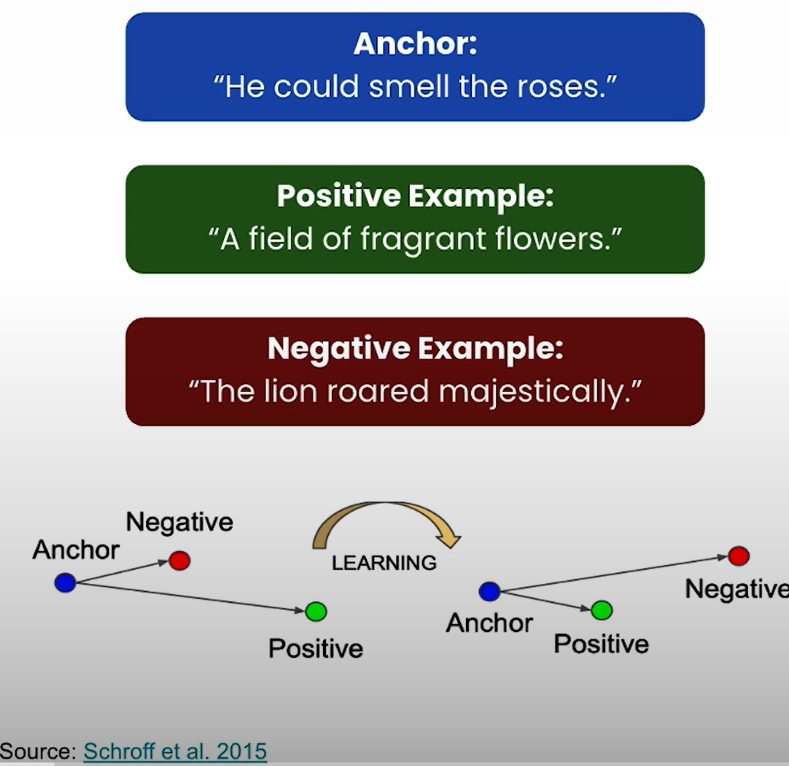
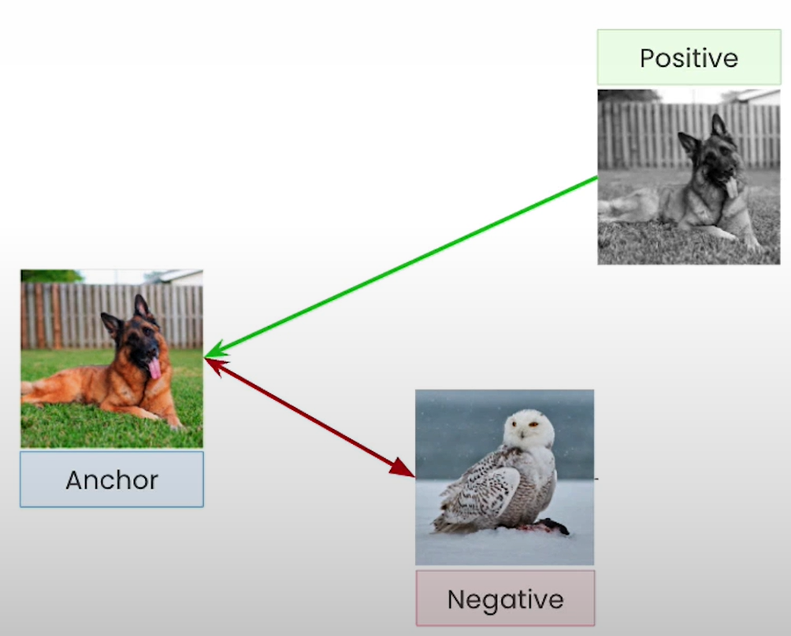
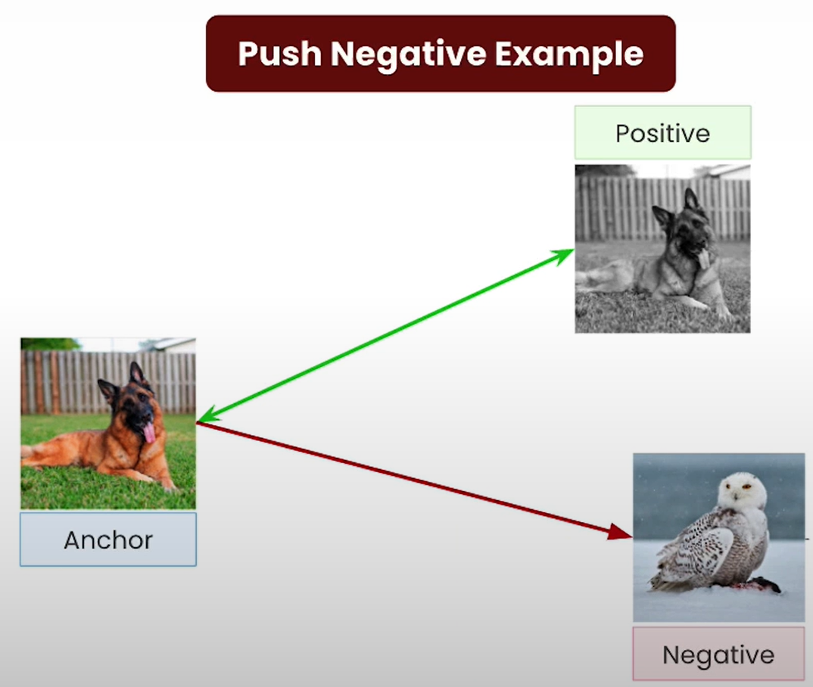
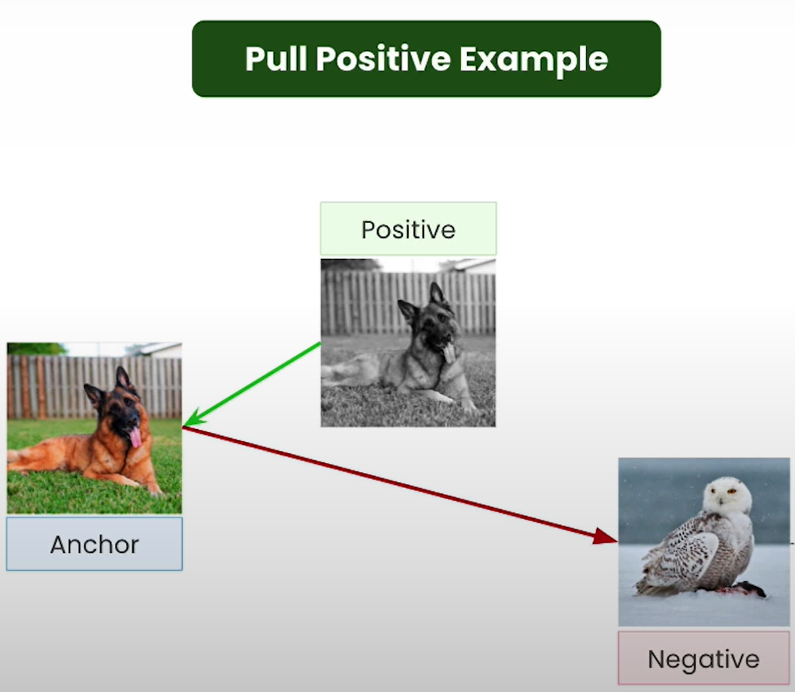
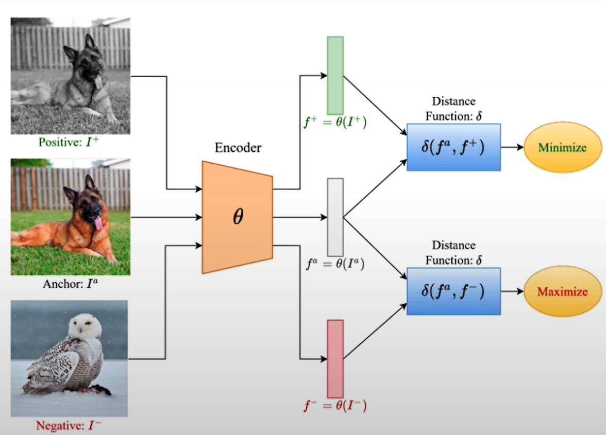
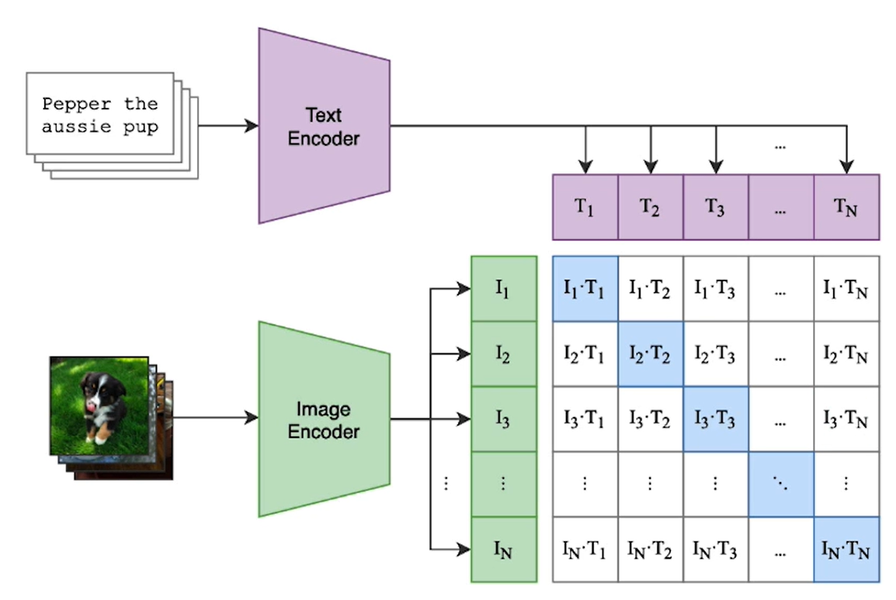
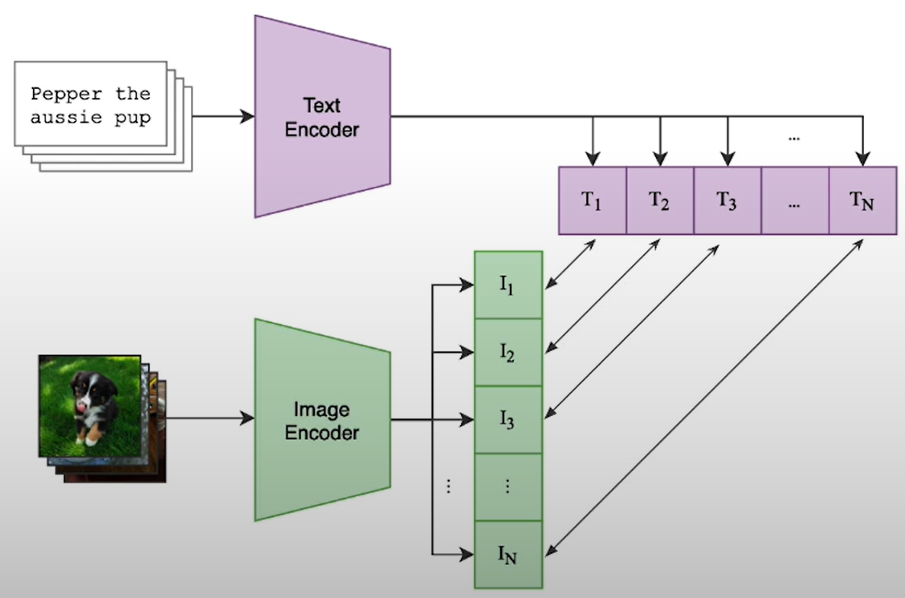
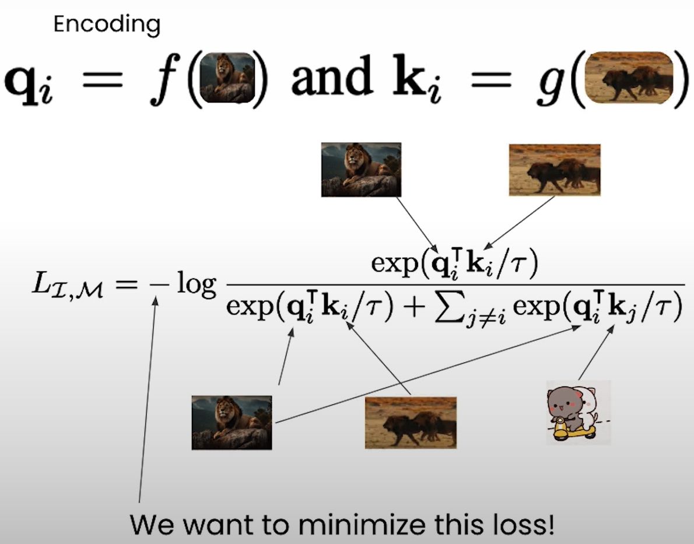

# Overview of Multimodality

- Multimodal Embedding Models
  - Allows us to represent multi-modal data on the same vector space
  _ These models produce a joint embedding space that understand all of your modalities.
  - These models preserve similarity across modalities.

## Training Multimodal Models

- Task 1: Start with specialist models
  - Text Encoder, Image Encoder, Audio Encoder, Video Encoder
- Task 2: Unify the specialist models
  - Objective: Regardless of modality, similar concepts should be close together.

### Unify the Models using Contrastive Learning

- The task of unifying multiple models into one embedding space is done using a process called Constrastive Representation.
- Contrastive Representation Learning
  - A general purpose process that can be used to train any embedding model, not just multi-modal embedding models.
  - Main idea: Create one vector space representation for multiple modalities.
  - Achieved by providing posiitve and negative eamples of similar and different concepts.
    - Models are trained to pull closer vectors for similar examples and push further vectors for different concepts.
      
      - Above figure shows what learning means: pushing away negative vector example from the anchor vector and bringing closer the positive vector example to the anchor vector.

### Understanding Contrastive Learning for Images

  
  
  

### Contrastive Loss Function

- Encoder: Computes vector embedding of anchor and the examples
- Learning: Minimizes/maximizes vector embedding similarity of examples with anchor depending on whether the examples are of similar concepts or different concepts.

### Finding Contrastive Examples

- Tricky part: Finding enough of anchors in contrastive examples
- CLIP: [Learning Transferable Visual Models From Natural Language Supervision by Radford et al (2021)](https://openai.com/index/clip/)

  - Picture in its caption represented an anchor in a positive example.
    - Represented in the diagonal of the matrix.
  - Any other pairing of picture and caption is likely to be a negative example.

### Understanding the Contrastive Loss Function

- $f$: Image encoder
- $g$: Video encoder
- Source: [ImageBind: One Embedding Space To Bind Them All by Girdhar et al (2023)](https://arxiv.org/abs/2305.05665)

## Notebook

- [Jupyter Notebook](../code/L1_Overview_of_Multimodality.ipynb)
  - $H_{out}$, $W_{out}$ values of conv1, conv2 can be computed as mentioned in [PyTorch Conv2d documentation](https://pytorch.org/docs/stable/generated/torch.nn.Conv2d.html).
  - Detailed discussion in the course: [Introduction to Deep Learning & Neural Networks](https://github.com/kaushikacharya/Introduction_to_Deep_Learning_and_Neural_Networks/blob/master/notes/Chapter_3.md#convolution-in-practice)
- Steps
  - Train an embedding model using contrastive loss
  - Visualize the learned vector space
- Cosine similarity as distance makes the embeddings for similar digits align in a spoke or line shape rather than a cluster.
  - Reasoning: Cosine distance depend on angles between embeddings unlike Euclidean distance which minimizes proximity.
- CosineSimilarity
  - [StackOverflow thread](https://stackoverflow.com/questions/70793278/is-this-the-right-way-to-compute-cosine-similarity-in-pytroch) describes how it reduces a dimension of the dimensions of the tensors.
  - [PyTorch documentation](https://pytorch.org/docs/stable/generated/torch.nn.CosineSimilarity.html) shows that dimension passed as input argument is squeezed.
- Issues faced:
  - ImportError: IProgress not found
    - [Saturn Cloud blog](https://saturncloud.io/blog/importerror-iprogress-not-found-please-update-jupyter-and-ipywidgets-although-it-is-installed/) explains the error and the fixes.
    - Only [installing ipywidgets](https://ipywidgets.readthedocs.io/en/stable/user_install.html) and restarting the notebook kernel worked for me.
  - RuntimeError: Input type (torch.cuda.FloatTensor) and weight type (torch.FloatTensor) should be the same
    - Changed `train_model` function to take `Network` object as it also needs to be moved to CUDA along with the images.
    - Similar change applied when executing with `train = False`
  - `plotly` plots not displaying in Jupyter notebook
    - Solution: [StackOverFlow thread](https://stackoverflow.com/questions/52771328/plotly-chart-not-showing-in-jupyter-notebook) suggests to set notebook mode to offline.
