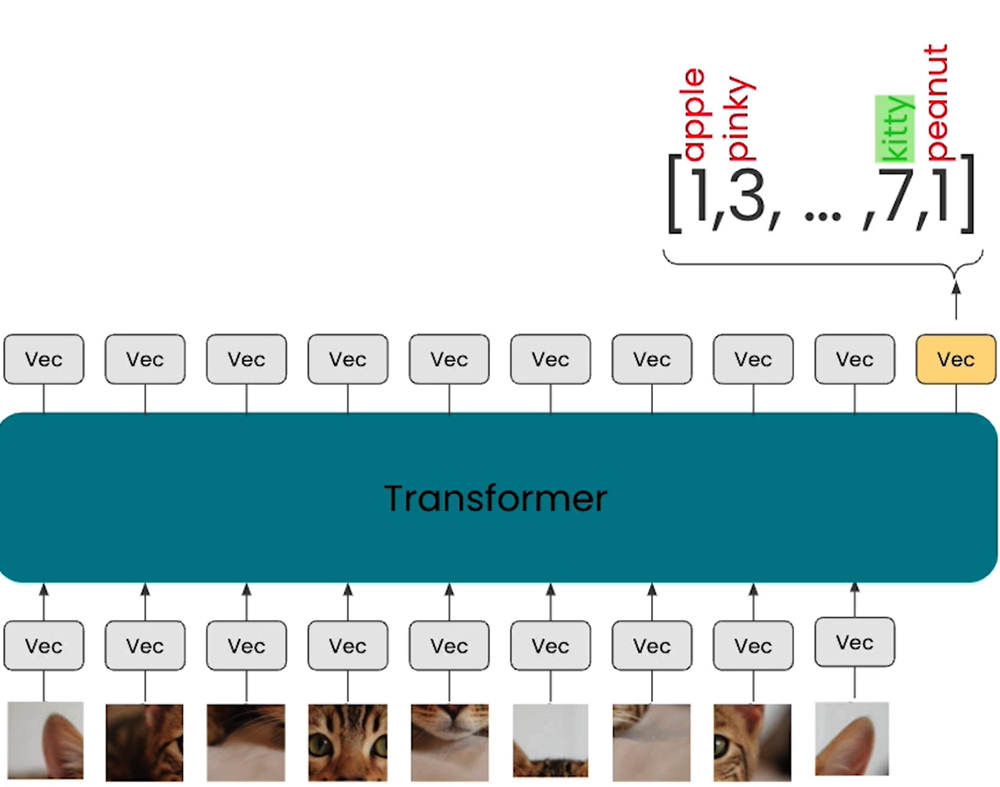

# Large Multimodal Models (LMMs)

## Lesson Objective

- How LLMs work and understand text
- How to combine LLMs and multimodal models into language vision models using a process called Visual Instruction tuning
- Finally, use all these models in practise

## How do Large Language Models work?

- The majority of current LLMs are generative pre-trained transformers (GPT)
- Autoregressive
- Future tokens are conditioned only on previously provided or generated tokens
- Unsupervised Training using next token prediction on trillions of tokens
- Probability distribution generated over tokens
  - The next token can be sampled from this distribution

## How do GPTs work?

## Vision Transformers

- Images are cut into patches
  - Using patches instead of pixels make it computationally efficient to process images
    
- Each patch is embedded and passed into a transformer
- The transformer outputs a probability distribution over the possible classes

  

### Visual Instruction Tuning

- [Github repository](https://github.com/haotian-liu/LLaVA) of paper: Visual Instruction Tuning by Liu et al (2023)

## Notebook

- **Pre-requisite for local execution**
  - Create API key from [Google AI Studio](https://ai.google.dev/gemini-api/docs/quickstart?lang=python#set-up-api-key)
  - Created keys are listed in [Google AI Studio](https://aistudio.google.com/app/apikey)
- [Jupyter Notebook](../code/L3_LMMs.ipynb)
- Steps
  - #1: You will use images and text as input
  - #2: You will get LMMs to reason over it
- [Gemini API quickstart](https://ai.google.dev/gemini-api/docs/quickstart?lang=python)
  - `genai.configure` is passed only api_key parameter
  - Also shown in Python code example [ai.google.dev](https://ai.google.dev/)
