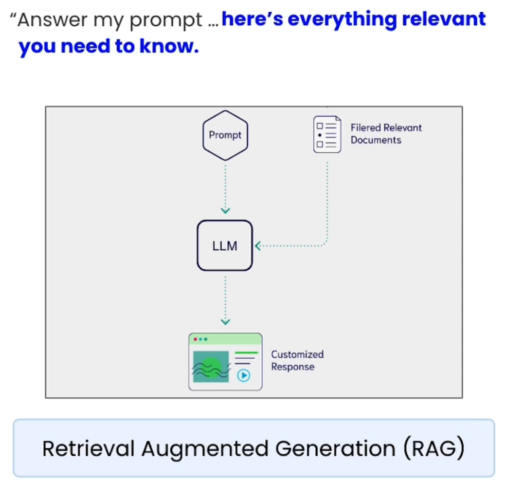
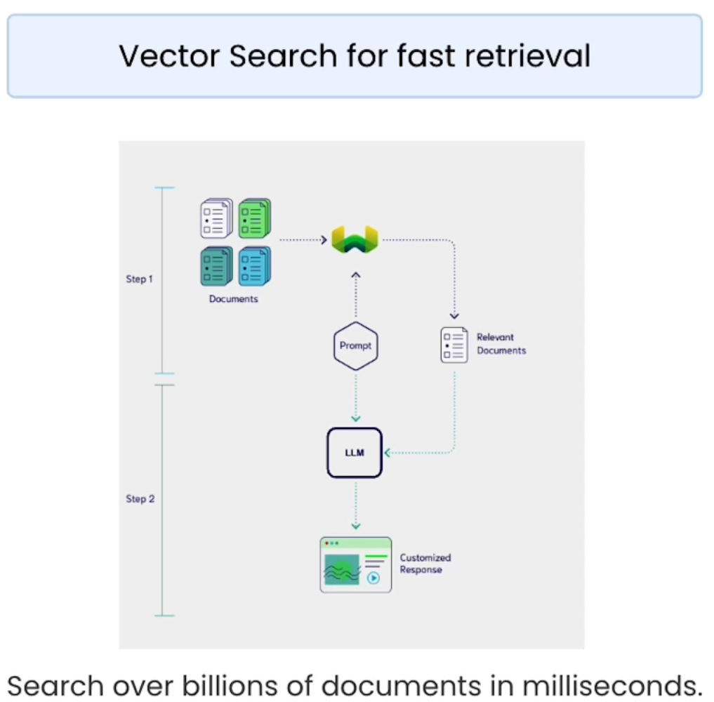
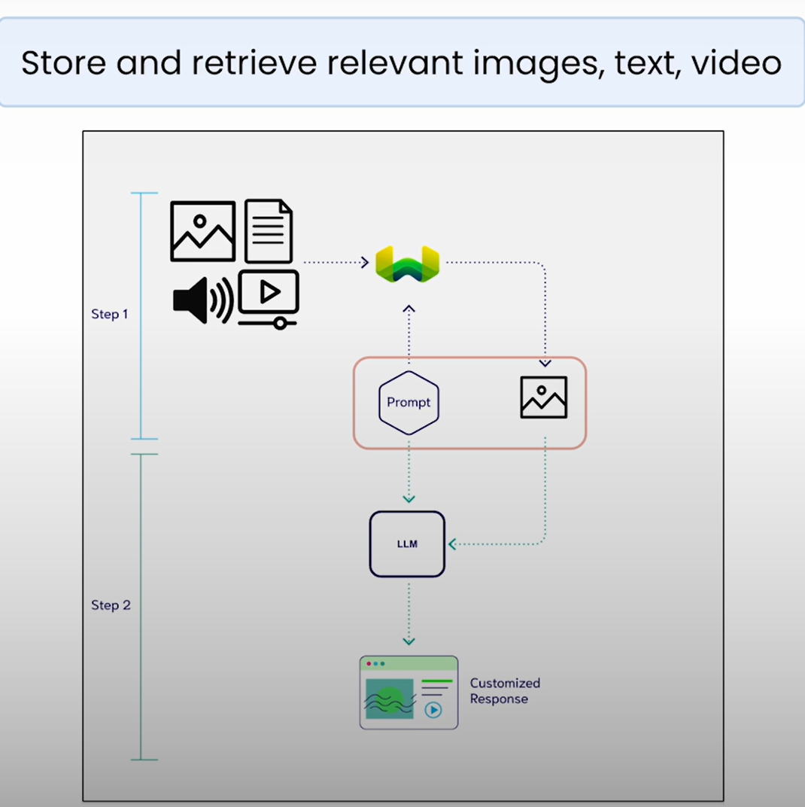

# Multimodal RAG (MM-RAG)

## Lesson Objectives

- Learn multimodal RAG: Mixing search with large multimodal models
- Implement multimodal RAG using Weaviate (Vector DB)

## Potential Solution

- Issue: LMM hallucination

  

- Solution using Vector DB e.g. Weaviate
  
  - Two step solution:
    - Step #1: Retrieve relevant documents from the database
    - Step #2: Add these documents as context to the LLM

### Multimodal Retrieval Augmented Generation (MM-RAG)

  

## Notebook

- Steps:
  - Step #1: Retrieve multimodal data from Weaviate
  - Step #2: Then pass this multimodal data into an LLM and reason over it.
- Generation of `EMBEDDING_API_KEY` for **local execution** is explained in [Lesson 2](./Lesson_2.md#notebook)
- Issue faced in local execution of Jupyter notebook
  - ```WeaviateQueryError: Query call with protocol GRPC search failed with message explorer: get class: vectorize params: vectorize params: vectorize params: vectorize keywords: remote client vectorize: connection to Google PaLM failed with status: 403 error: Permission 'aiplatform.endpoints.predict' denied on resource '//aiplatform.googleapis.com/projects/semi-random-dev/locations/us-central1/publishers/google/models/multimodalembedding@001' (or it may not exist)..```
  - This is due to project id of backup collection being different from the project id of my Google Cloud project.
  - Attempted data migration suggestion from [Weaviate forum](https://forum.weaviate.io/t/failure-in-retrieving-content-from-a-backup-restored-collection-created-on-a-different-machine/4434) but this too failed due to inability of instantiating another weaviate embedded instance.
